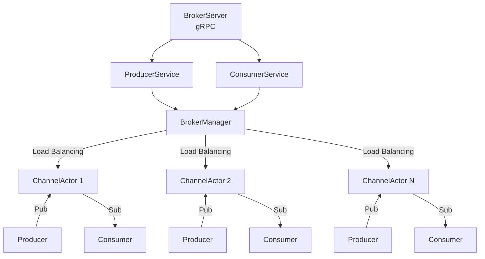

# Sentinel Pulse Broker

A distributed message broker built with Apache Pekko and gRPC, implementing a pub/sub pattern with support for multiple channels, message TTL, and load balancing.

## Overview

Sentinel Pulse Broker is a high-performance message broker that enables asynchronous communication between services using a publish/subscribe pattern. It leverages Apache Pekko's actor model for concurrent message handling and gRPC for efficient, type-safe communication.

## Features

- **Multi-Channel Pub/Sub**: Publish and subscribe to multiple distinct channels
- **TTL Support**: Messages can be configured with Time-To-Live expiration
- **Load Balancing**: Distributes channels across multiple actor instances
- **Message Persistence**: Stores messages in memory with configurable expiration
- **Historical Data**: New subscribers can receive previously stored messages
- **gRPC API**: Type-safe protocol buffers-based API
- **Docker Support**: Ready-to-deploy Docker container

## Architecture



### Core Components

- **BrokerServer**: gRPC server handling incoming requests
- **ProducerService**: Handles message publishing
- **ConsumerService**: Handles message consumption/subscription
- **BrokerManager**: Manages channel actor pool and load distribution
- **ChannelActors**: Individual actors handling message storage and delivery per channel

## Technology Stack

- **Scala** 3.3.4
- **Apache Pekko** 1.4.0 (Actor, Stream, gRPC)
- **gRPC** with Protocol Buffers
- **Logback** for logging
- **sbt** as build tool
- **Docker** for deployment

## Configuration

Configure the broker via `application.conf`:

```hocon
broker {
  ip = "0.0.0.0"
  port = 8080
  actors = 4
}
```

| Parameter       | Description                                      | Default   |
|-----------------|--------------------------------------------------|-----------|
| `broker.ip`     | IP address to bind                               | `0.0.0.0` |
| `broker.port`   | Port number                                      | `8080`    |
| `broker.actors` | Number of actors to store the different channels | `4`       |

## API

### Producer Service

```protobuf
service ProducerService {
  rpc push(stream PublishRequest) returns (PublishSummary);
}
message PublishRequest {
  oneof payload {
    PublishMetadata metadata = 1;
    bytes data = 2;
  }
}
message PublishMetadata {
  string channel = 1;
  int64 ttl = 2;
}

message PublishSummary {
  bool success = 1;
  int32 count = 2;
  string error_message = 3;
}
```

### Consumer Service

```protobuf
service ConsumerService {
  rpc pull(PullRequest) returns (stream PullResponse);
}
message PullRequest {
  string channel = 1;
  bool all_messages = 2;
}

message PullResponse {
  string channel = 1;
  bytes payload = 2;
}
```

## Building

```bash
sbt compile
```

## Testing

```bash
sbt test
```

## Docker

Build the Docker image:

```bash
sbt Docker/publishLocal
```

Run the container:

```bash
docker run -d -p 8080:8080 --name broker sentinel-pulse-broker:latest
```

## Usage Example

See [Python Examples](examples/python/README.md) for client implementation in Python.

## License

MIT License